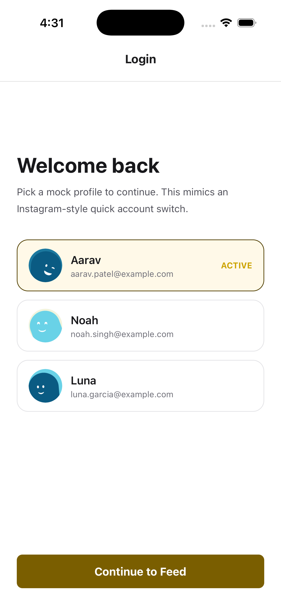
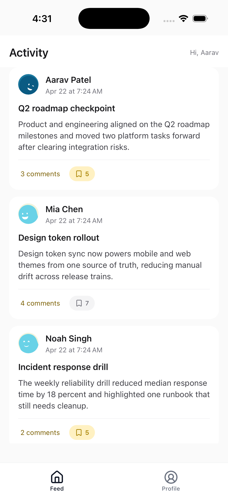
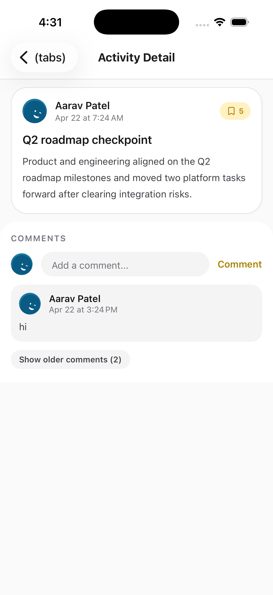
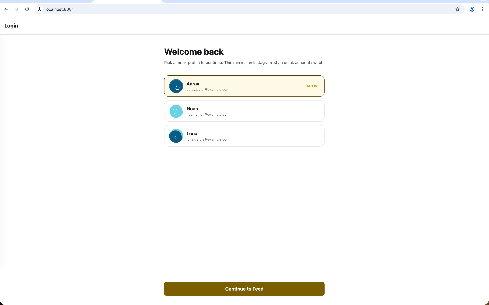
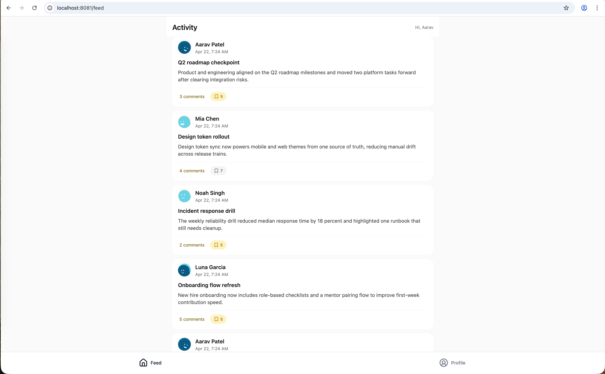
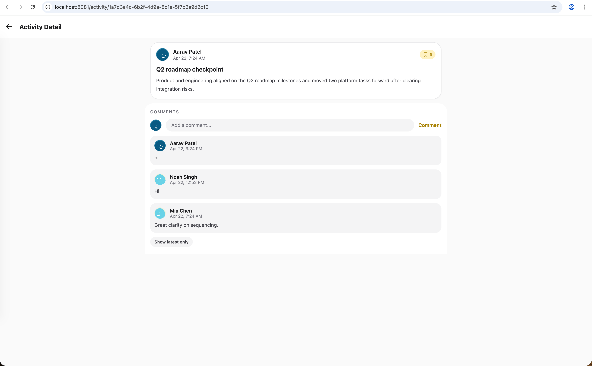

# Activity Feed App

Cross-platform Expo application for the Staff Frontend Engineer assessment.

## Overview

This app uses Expo Router, Apollo Client, and Redux Toolkit to deliver an activity experience across web, iOS, and Android:

- Login-like account picker using mock users
- Paginated activity feed with cursor-based loading
- Activity detail screen with comments
- Add comment flow with pending UI state and refetch
- Optimistic bookmark toggle with Apollo cache rollback on error

## Screenshots

### Mobile

| Welcome | Feed | Activity Detail |
|---|---|---|
|  |  |  |

### Web

| Welcome | Feed | Activity Detail |
|---|---|---|
|  |  |  |

## Tech Stack

- Expo SDK 54
- React Native 0.81.5
- React 19.1.0
- Expo Router 6
- Apollo Client 4
- TypeScript 5.8
- Redux Toolkit 2
- twrnc

## Prerequisites

- Node.js 20+
- pnpm
- Xcode (for iOS)
- Android Studio + Android SDK (for Android)

## Setup

Install dependencies:

```bash
pnpm install
```


## Environment Variables

Create a `.env` file in the project root with:

```env
EXPO_PUBLIC_SUPABASE_GRAPHQL_URL=https://<project-ref>.supabase.co/graphql/v1
EXPO_PUBLIC_SUPABASE_ANON_KEY=<supabase-anon-key>
```

Note: The current Apollo client is configured for Supabase GraphQL. A local mock GraphQL fallback is not wired in the active runtime path.

## Run

```bash
pnpm start
-> press w for web
-> press i for ios
-> press a for android
```

## Development Commands

```bash
pnpm lint
pnpm typecheck
pnpm test
```

## Project Structure

```text
app/
	_layout.tsx            # Root stack and providers
	index.tsx              # Account picker / entry screen
	(tabs)/
		_layout.tsx          # Tabs
		feed.tsx             # Feed screen
		profile.tsx          # Profile and user switcher
	activity/
		[id].tsx             # Activity detail screen

src/
	features/
		activity-feed/
		activity-detail/
	hooks/
		useFeedViewModel.ts
		useActivityDetailViewModel.ts
	lib/apollo/
		client.ts
		cache.ts
		queries.ts
		mutations.ts
	providers/
		AppProviders.tsx
	store/
		slices/userSlice.ts

ui/
	atoms/
	molecules/
	views/
```

## Testing

Current tests include:

- Feed utility tests (`truncateBody`)
- UI button interaction tests

Run all tests with:

```bash
pnpm test
```

## Documentation

- [docs/About.md](docs/About.md)
- [docs/ADR.md](docs/ADR.md)
- [docs/UI.md](docs/UI.md)
